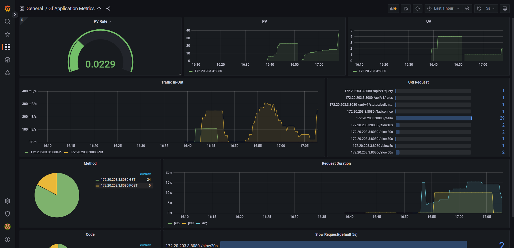

# gf-metrics
gf metrics exporter for Prometheus.


## Introduction

`gf-metrics` 为 Gf HTTP 服务定义了一些监控指标，开箱即用。下边是默认监控指标的详细描述：


| Metric                  | Type      | Description                                         |
| ----------------------- | --------- | --------------------------------------------------- |
| gf_request_total       | Counter   | 服务接收到的请求总数                |
| gf_request_uv          | Counter   | 服务接收到的 IP 总数                     |
| gf_uri_request_total   | Counter   | 每个 URI 接收到的服务请求数 |
| gf_request_body_total  | Counter   | 服务接收到的请求量，单位: 字节   |
| gf_response_body_total | Counter   | 服务返回的请求量，单位: 字节      |
| gf_request_duration    | Histogram | 服务处理请求使用的时间         |
| gf_slow_request_total  | Counter   | 服务接收到的慢请求计数     |

## Grafana


Set the `grafana` directory for details.




## Installation

```bash
$ go get github.com/168yy/gf-metrics
```

## Usage

使用如下代码运行，访问：`http://localhost:8080/metrics` 即可看到暴露出来的监控指标

```go
package main

import (
	"github.com/gogf/gf/v2/frame/g"

	"github.com/jxo/gf-metrics/metrics"
)

func main() {
	s := g.Server()
	s.SetAddr(":8080")
	// get global Monitor object
	m := metrics.GetMonitor()
	// +optional set metric path, default /metrics
	m.SetMetricPath("/metrics")
	// +optional set slow time, default 5s
	m.SetSlowTime(10)
	// +optional set request duration, default {0.1, 0.3, 1.2, 5, 10}
	// used to p95, p99
	m.SetDuration([]float64{0.1, 0.3, 1.2, 5, 10})
	// set middleware for gf
	m.Use(s)
	r := s.Group("")
	r.GET("/hello", func(r *ghttp.Request) { r.Response.Write("Hello") })
	s.Run()
}

```

## Custom Metric

`gf-metric` 提供了自定义监控指标的使用方式

### Gauge

使用 `Gauge` 类型监控指标，可以通过 3 种方法来修改监控值：`SetGaugeValue`、`Inc`、`Add`

首先，需要定义一个 `Gauge` 类型的监控指标：

```go
gaugeMetric := &metrics.Metric{
    Type:        metrics.Gauge,
    Name:        "example_gauge_metric",
    Description: "an example of gauge type metric",
    Labels:      []string{"label1"},
}

// Add metric to global monitor object
_ = metrics.GetMonitor().AddMetric(gaugeMetric)
```

**SetGaugeValue**

`SetGaugeValue` 方法会直接设置监控指标的值

```go
_ = metrics.GetMonitor().GetMetric("example_gauge_metric").SetGaugeValue([]string{"label_value1"}, 0.1)
```

**Inc**

`Inc` 方法会在监控指标值的基础上增加 1

```go
_ = metrics.GetMonitor().GetMetric("example_gauge_metric").Inc([]string{"label_value1"})
```

**Add**

`Add` 方法会为监控指标增加传入的值

```go
_ = metrics.GetMonitor().GetMetric("example_gauge_metric").Add([]string{"label_value1"}, 0.2)
```

### Counter

`Counter` 类型的监控指标，可以使用 `Inc` 和 `Add` 方法，但是不能使用 `SetGaugeValue` 方法


### Histogram and Summary

对于 `Histogram` 和 `Summary` 类型的监控指标，需要用 `Observe` 方法来设置监控值。

